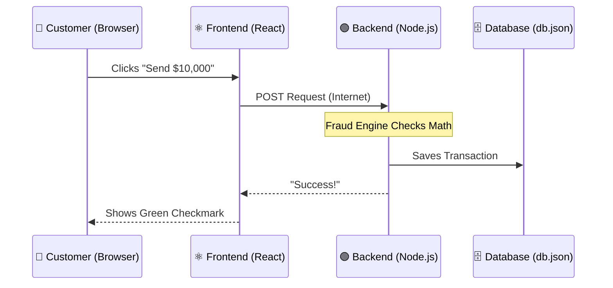

# 🎓 The Ultimate Developer Learning Guide: Building a Corporate Bank

Welcome to the ultimate learning tutorial. Whether you are an absolute beginner looking at code for the first time, or an intermediate developer wanting to understand enterprise architecture, this guide is designed for you.

We are going to break down how to build a **Corporate Banking Application** from scratch. We will explain every single keyword, symbol, and concept. 

---

## 📖 1. The Real-World Story (Why are we building this?)

**Imagine this scenario:** You have just been hired as the Lead Software Engineer at *Dileepkumar Bank*. The bank is currently using 40-year-old paper records and physical filing cabinets. 

The Bank Director gives you two massive requirements:
1. **The Customer Portal:** Customers need a secure website to log in, view their balances, and send money to other people across the globe.
2. **The Operations Console:** Bank Employees need a website to review loan applications and catch criminals trying to launder money.

To build this, you need a **Frontend** (what the user sees) and a **Backend** (the bank's vault that processes the math and stores the data). 

---

## 🏗️ 2. The Architecture (How it works)

Here is a visual map of how our code talks to each other over the internet.



### The Tools We Chose:
*   **React (Frontend):** It builds the buttons, tables, and colors on the screen.
*   **Node.js & Express (Backend):** It runs on a server 24/7, waiting for the Frontend to ask it questions. It does the heavy lifting (math, security checks).

---

## 💻 3. Deep Dive: The Frontend (React)

Let's look at a real piece of code from our project, `Dashboard.jsx`, and explain *every single word*.

```jsx
import { useState } from 'react';

const Dashboard = () => {
  const [balance, setBalance] = useState(5000);

  return (
    <div>
      <h1>Your Balance: ${balance}</h1>
      <button onClick={() => setBalance(balance + 100)}>Deposit $100</button>
    </div>
  );
};

export default Dashboard;
```

### Line-by-Line Breakdown:
1.  `import { useState } from 'react';`
    *   **What it does:** We are borrowing a tool called `useState` from the React library.
    *   **`import`**: A keyword that means "bring something in".
    *   **`{ useState }`**: The specific tool we want. (The curly braces `{}` mean we only want this specific part, not the whole library).
2.  `const Dashboard = () => {`
    *   **What it does:** We are creating our Component (our Lego block).
    *   **`const`**: A keyword meaning "Constant". It means `Dashboard` cannot be overwritten later.
    *   **`() => {`**: This is called an "Arrow Function". It is simply a recipe. It says "When Dashboard is called, execute the instructions inside these brackets `{}`".
3.  `const [balance, setBalance] = useState(5000);`
    *   **What it does:** This is the Component's memory. We start the user with $5000.
    *   **`balance`**: A variable that holds the current number (5000).
    *   **`setBalance`**: A special function that is the *only* way allowed to change the balance.
    *   **`useState(5000)`**: Tells React to remember this number, and if it ever changes, redraw the screen immediately!
4.  `return ( ... );`
    *   **What it does:** This is what the Component actually puts on the screen (the HTML).
5.  `<h1>Your Balance: ${balance}</h1>`
    *   **`<h1>`**: HTML for "Heading 1" (Big bold text).
    *   **`{balance}`**: The curly braces tell React: "Stop reading this as text, and instead look inside your memory for the variable named balance."
6.  `<button onClick={() => setBalance(balance + 100)}>`
    *   **`onClick`**: An event listener. It waits for the user's mouse click.
    *   **`() => setBalance(balance + 100)`**: When clicked, it runs the `setBalance` function, taking the old balance (5000) and adding 100. Because `setBalance` was used, React instantly redraws the `<h1>` to show 5100!
7.  `export default Dashboard;`
    *   **What it does:** This allows other files in our project to `import` and use this Component.

---

## ⚙️ 4. Deep Dive: The Backend (Node.js)

The Frontend is just the visual layer. If the user refreshes the page, their balance resets. To save data permanently, we need a Backend. 

Here is how we accept a Wire Transfer in `server.js`:

```javascript
app.post('/api/transactions', (req, res) => {
  const amount = parseFloat(req.body.amount);
  
  if (amount <= 0) {
    return res.status(400).json({ error: 'Amount must be positive!' });
  }

  // Save to database...
  res.status(201).json({ message: 'Success' });
});
```

### Line-by-Line Breakdown:
1.  `app.post('/api/transactions', (req, res) => {`
    *   **`app.post`**: We are opening a "door" on our server that accepts incoming data (`POST`).
    *   **`'/api/transactions'`**: The specific address of this door.
    *   **`req` (Request)**: Contains the data the user sent us (e.g., how much money they want to send).
    *   **`res` (Response)**: The tool we use to send an answer back to the user (e.g., "Success" or "Failed").
2.  `const amount = parseFloat(req.body.amount);`
    *   **`req.body.amount`**: We look inside the "body" of the package the user sent us to find the `amount`.
    *   **`parseFloat`**: A built-in JavaScript tool that converts text (like "100.50") into a strict mathematical number with decimals.
3.  `if (amount <= 0) {`
    *   **What it does:** This is a logic gate. `if` the amount is Less Than (`<`) or Equal To (`=`) Zero (`0`).
4.  `return res.status(400).json({ error: 'Amount must be positive!' });`
    *   **What it does:** If the user tries to send negative money, we immediately stop the code (`return`). 
    *   **`res.status(400)`**: We send a "400 Bad Request" HTTP error code back to their browser.
    *   **`.json(...)`**: We send the error message formatted as JSON (JavaScript Object Notation), which is the universal language of the internet.

---

## 🧠 5. The Business Logic: Underwriting & Fraud

Building forms is easy. Building *logic* is what makes a Senior Engineer. Here is how we built the algorithms for Dileepkumar Bank.

### The Loan Underwriting Algorithm
When a customer applies for a loan, an employee shouldn't have to manually calculate their risk. We wrote an algorithm:
1.  **DTI (Debt-to-Income):** The code takes their Monthly Debt and divides (`/`) it by their Monthly Income, then multiplies (`*`) by 100 to get a percentage. If DTI > 50%, they are high risk!
2.  **FICO Simulation:** The code starts them at a perfect 850 credit score, and mathematically subtracts points for every 1% of DTI they have. 
3.  **System Recommendation:** Using `if/else` statements, if the FICO is < 600, the system automatically prints out a giant red `REJECT` warning for the bank employee.

### The AML Fraud Engine
Anti-Money Laundering (AML) laws require banks to report large cash movements.
*   When the server receives a transaction, it checks: `if (amount >= 10000)`.
*   If true, the server flags the transaction, halts the money movement, and alerts the Employee Dashboard to file a **CTR (Currency Transaction Report)**.

---

## 🚧 6. Developer Challenges & Solutions

When building a full-stack application of this massive size, you will inevitably face severe challenges. Here is what we faced and how we solved it:

### Challenge 1: The "Event Loop Block" (Performance)
*   **The Problem:** Originally, whenever someone sent money, the backend used `fs.writeFileSync` to save data to the hard drive. This is *synchronous*, meaning the entire server completely froze until the hard drive finished saving. If 100 people sent money at the exact same second, the 100th person had to wait in a massive line.
*   **The Solution:** We refactored the code to use `fs.promises.writeFile`. This is *asynchronous*. Now, when the server tells the hard drive to save, it doesn't wait. It immediately turns around to serve the next customer, making the bank lightning fast.

### Challenge 2: The "Path Traversal Hack" (Security)
*   **The Problem:** We built a route for employees to download PDF documents: `/api/documents/download/:filename`. However, a hacker realized they could send a filename like `../../../server.js`. The server blindly followed those `../` instructions to go backwards in the folders and accidentally handed the hacker our entire source code!
*   **The Solution:** We implemented `path.basename()`. This built-in Node tool automatically strips out any sneaky folder navigation characters, forcing the server to only look inside the highly secure `uploads/` folder.

---

## ⚖️ 7. Advantages & Disadvantages of this Architecture

Every architectural decision in software engineering is a trade-off. Here is an honest assessment of our stack:

### ✅ Advantages
1.  **Single Language (JavaScript):** Because we used React and Node.js, we wrote the entire bank in JavaScript. Developers don't have to context-switch between Python on the backend and JS on the frontend.
2.  **Monorepo Structure:** Keeping the frontend and backend in the same GitHub repository makes it incredibly easy for new developers to clone the code and start the entire ecosystem with just two commands.
3.  **Stateless API:** Our Node server uses JWT (JSON Web Tokens) instead of old-school cookies. This means the server doesn't have to remember who is logged in; the VIP wristband (token) proves it instantly, making the server use way less memory.

### ❌ Disadvantages
1.  **JSON Database Limits:** Currently, the bank saves data to a local `db.json` text file. While this is incredible for learning and local testing, if the file grows to 5 Gigabytes, the server will crash trying to open it. *(Future Upgrade: Migrate to a real database like PostgreSQL or MongoDB).*
2.  **SEO Capabilities:** Because this is a standard React "Single Page Application", search engines like Google have a hard time reading the page. If Dileepkumar Bank wanted their login page to rank #1 on Google, we would need to migrate to a framework like Next.js for Server-Side Rendering.

---
*Happy Coding! Use this project as a playground. Break the code, fix it, and learn how enterprise software truly works.*
