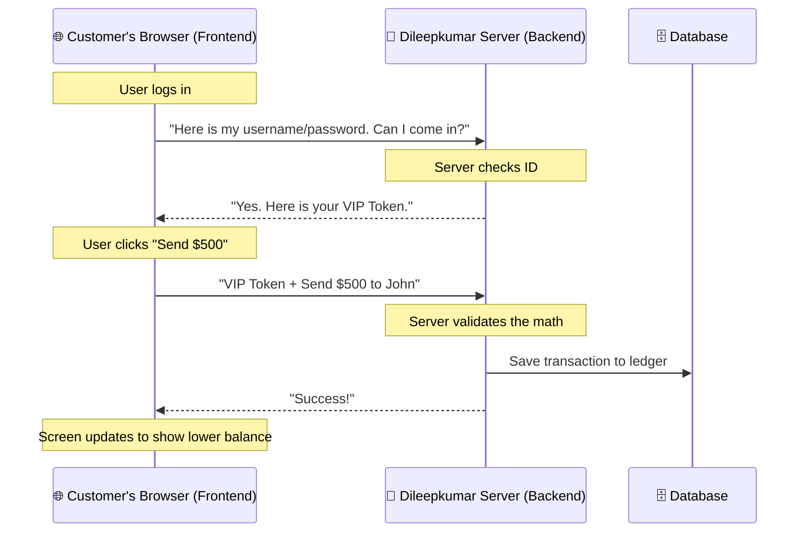

# 02: System Architecture 🏗️

Before you write a single line of code, you must understand the "Big Picture". How do the different pieces of software talk to each other?

In modern web development, we divide the application into two distinct halves: The **Frontend** (Client) and the **Backend** (Server).

## The Big Picture (How a Bank Works)

Imagine you walk into a physical bank branch to deposit a check. 
*   **The Frontend** is the beautiful lobby. It has nice leather chairs, a clear sign showing the exchange rates, and a friendly teller who smiles at you. It is everything you *see* and *interact* with.
*   **The Backend** is the steel vault in the back room, the security cameras, and the manager's office where they check if your check is fake. You, the customer, are never allowed to go back there. Only the teller (the API) is allowed to take your check to the vault.

Here is how that looks in our code:

## 1. The Frontend (React)

The Frontend is the code that runs *inside the user's web browser* (like Google Chrome or Safari). 

In Dileepkumar Bank, we built the Frontend using **React**. React is a JavaScript library built by Facebook. It is designed to build User Interfaces (UI) using "Components" (like Lego blocks). 

Instead of writing one massive HTML file, we write small pieces of code (e.g., a `<Button>`, a `<Header>`, a `<TransactionTable>`) and snap them together to build a page.

**Why did we choose React?**
Because React is incredibly fast. When a user sends money, React doesn't force the whole web page to refresh and go blank. It instantly updates just the one number on the screen, making the app feel like a native mobile app.

## 2. The Backend (Node.js & Express)

The Backend is the code that runs on a remote computer (the server) sitting in a data center somewhere. 

In our bank, the backend is built using **Node.js** (which lets us run JavaScript on a server) and **Express** (a tool that makes it easy to create "doors" for the frontend to talk to).

**Why do we need a Backend?**
You cannot trust the Frontend! Because the frontend code lives on the user's computer, a hacker can easily open their browser's "Developer Tools", find the code that says `balance = $50`, and change it to `balance = $1,000,000`. 

If we didn't have a backend, the hacker would instantly be a millionaire. But because we have a backend, the frontend is just a "dumb display". The *real* balance is stored in the Backend Vault. When the hacker clicks "Buy a Ferrari for $300,000", the frontend sends the request to the backend. The backend checks its secure vault, sees the user only has $50, and says "REJECTED".

## 3. The Database (db.json)

The database is the permanent memory of the application. If the server crashes or loses power, everything in its short-term memory is erased. The database writes the data to the hard drive so it survives forever.

In a massive enterprise bank, you would use a giant database like **PostgreSQL** or **MongoDB**. For this learning project, we built a custom lightweight database using a text file called `db.json`. It works exactly the same way (saving data to the hard drive), but it makes the code much easier for you to read and understand!

---
Next up, let's dive into the code and learn how to master React in **Lesson 03: Frontend Mastery**.
