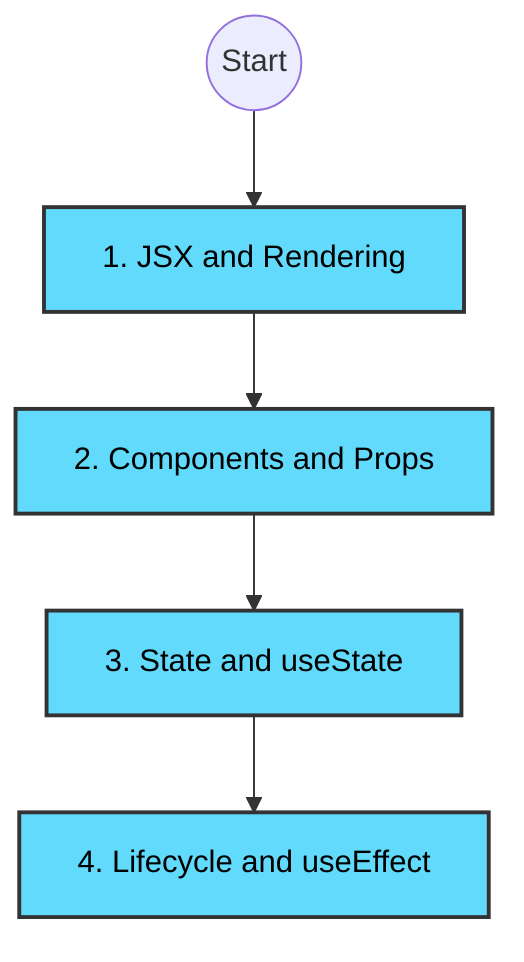

# 08: Interactive React Developer Roadmap ⚛️

Welcome to the **Frontend Engineering** bootcamp path. This roadmap will teach you exactly how we built the beautiful user interface for Dileepkumar Bank using React.

*(Click on any yellow box to read our exhaustive, point-by-point encyclopedia explanation of that topic with real-world examples!)*

