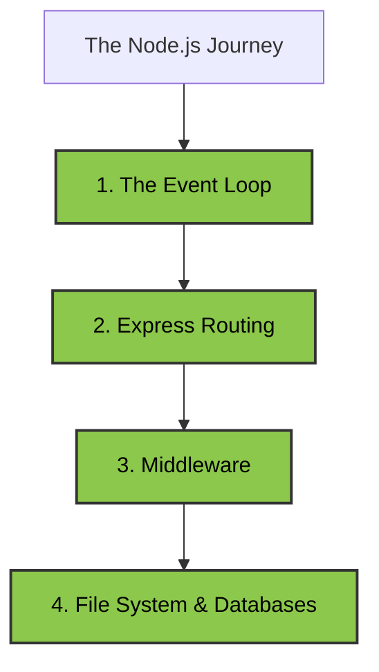

# 09: Interactive Node.js Developer Roadmap 🟢

Welcome to the **Backend Engineering** bootcamp path. This roadmap will teach you exactly how we built the secure, high-performance vault for Dileepkumar Bank using Node.js and Express.

*(Click on any green box to read our exhaustive, point-by-point encyclopedia explanation of that topic with real-world examples!)*

Mastering these 4 pillars allows you to build secure enterprise backends capable of handling thousands of requests per second!
