# 10: Interactive Java FullStack Roadmap ☕

Welcome to the **Enterprise Engineering** bootcamp path. Java is the absolute industry standard for building global financial institutions. 

Below is the **Granular Interactive Roadmap** for mastering the Java ecosystem. 

*(Click on any yellow box to instantly dive into a point-by-point encyclopedia explanation of that topic!)*

```mermaid
graph TD
    classDef clickable fill:#f9f06b,stroke:#333,stroke-width:2px,color:#000,cursor:pointer;
    classDef center fill:#ffeb3b,stroke:#000,stroke-width:3px,color:#000;

    Center[Learn the Basics]
    class Center center

    %% Left Side Branches
    Center ---|1| Syntax[Basic Syntax]
    Center ---|2| Life[Lifecycle of a Program]
    Center ---|3| Types[Data Types]
    Center ---|4| Vars[Variables and Scopes]
    Center ---|5| Cast[Type Casting]

    %% Right Side Branches
    Center ---|6| Str[Strings and Methods]
    Center ---|7| Math[Math Operations]
    Center ---|8| Arr[Arrays]
    Center ---|9| Cond[Conditionals]
    Center ---|10| Loop[Loops]
    Center ---|11| OOP[Basics of OOP]

    %% Make them all clickable!
    class Syntax clickable
    
    class Life clickable
    
    class Types clickable
    
    class Vars clickable
    
    class Cast clickable
    
    class Str clickable
    
    class Math clickable
    
    class Arr clickable
    
    class Cond clickable
    
    class Loop clickable
    
    class OOP clickable
```

*Want a static image instead? Download the official roadmap [PNG version](./java-roadmap.png) or [PDF version](./java-roadmap.pdf).*

## 📚 Java Tutorials (Click to Read!)
* [1. Basic Syntax](./java-roadmap/01-Learn-The-Basics/01-Basic-Syntax.md)
* [2. Lifecycle of a Program](./java-roadmap/01-Learn-The-Basics/02-Lifecycle.md)
* [3. Data Types](./java-roadmap/01-Learn-The-Basics/03-Data-Types.md)
* [4. Variables and Scopes](./java-roadmap/01-Learn-The-Basics/04-Variables-and-Scopes.md)
* [5. Type Casting](./java-roadmap/01-Learn-The-Basics/05-Type-Casting.md)
* [6. Strings and Methods](./java-roadmap/01-Learn-The-Basics/06-Strings-and-Methods.md)
* [7. Math Operations](./java-roadmap/01-Learn-The-Basics/07-Math-Operations.md)
* [8. Arrays](./java-roadmap/01-Learn-The-Basics/08-Arrays.md)
* [9. Conditionals](./java-roadmap/01-Learn-The-Basics/09-Conditionals.md)
* [10. Loops](./java-roadmap/01-Learn-The-Basics/10-Loops.md)
* [11. Basics of OOP](./java-roadmap/01-Learn-The-Basics/11-Basics-of-OOP.md)
