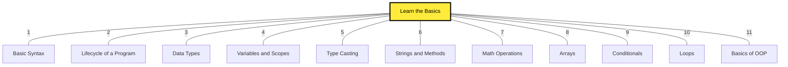

# 10: Interactive Java FullStack Roadmap ☕

Welcome to the **Enterprise Engineering** bootcamp path. Java is the absolute industry standard for building global financial institutions. 

Below is the **Granular Interactive Roadmap** for mastering the Java ecosystem. 

*(Click on any yellow box to instantly dive into a point-by-point encyclopedia explanation of that topic!)*

*Want a static image instead? Download the official roadmap [PNG version](./java-roadmap.png) or [PDF version](./java-roadmap.pdf).*
